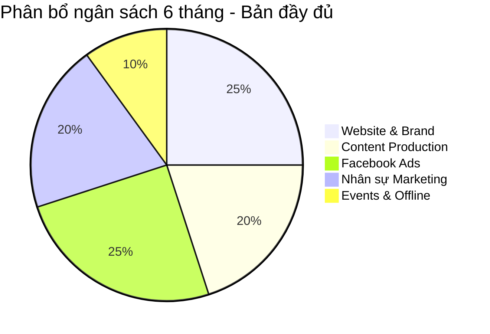
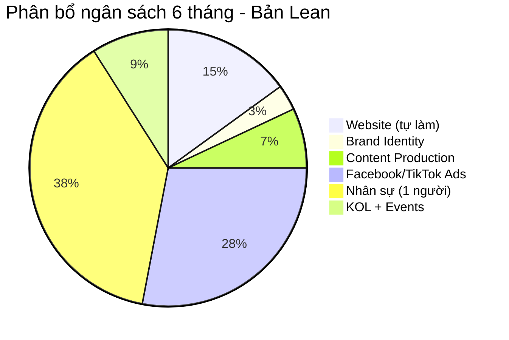
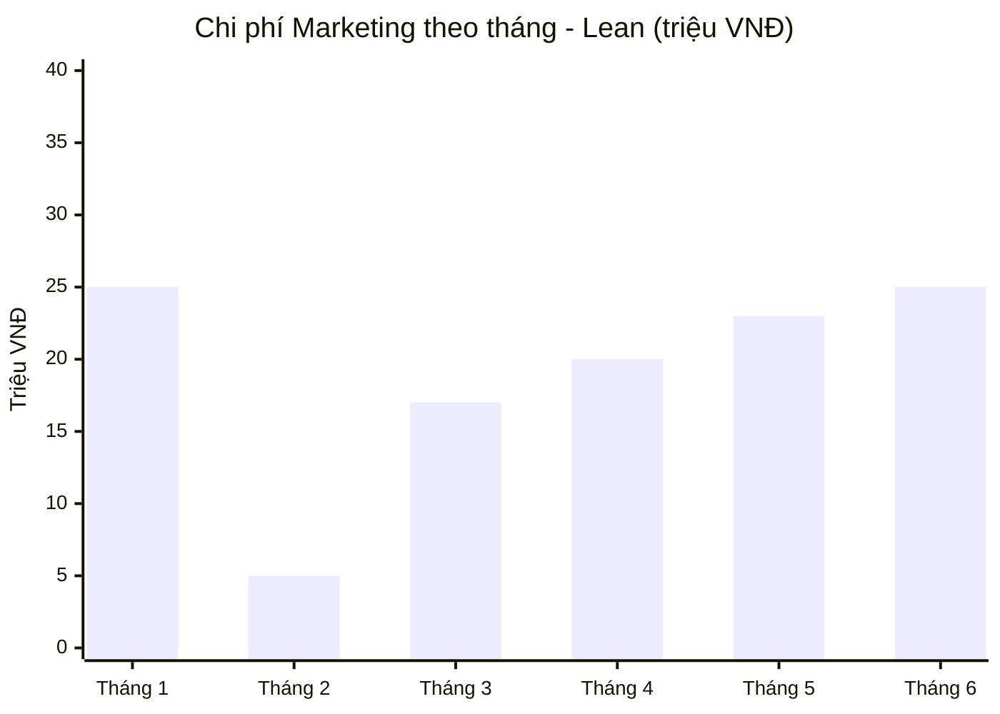

# Phân bổ Ngân sách

## Bản đầy đủ (~270 triệu / 6 tháng)

```mermaid
pie title Phân bổ ngân sách 6 tháng - Bản đầy đủ
    "Website & Brand" : 25
    "Content Production" : 20
    "Facebook Ads" : 25
    "Nhân sự Marketing" : 20
    "Events & Offline" : 10
```

## Bản Lean (~130 triệu / 6 tháng)

```mermaid
pie title Phân bổ ngân sách 6 tháng - Bản Lean
    "Website (tự làm)" : 15
    "Brand Identity" : 3
    "Content Production" : 7
    "Facebook/TikTok Ads" : 28
    "Nhân sự (1 người)" : 38
    "KOL + Events" : 9
```

## Chi phí theo tháng (Lean)

```mermaid
xychart-beta
    title "Chi phí Marketing theo tháng - Lean (triệu VNĐ)"
    x-axis ["Tháng 1", "Tháng 2", "Tháng 3", "Tháng 4", "Tháng 5", "Tháng 6"]
    y-axis "Triệu VNĐ" 0 --> 40
    bar [25, 5, 17, 20, 23, 25]
```
