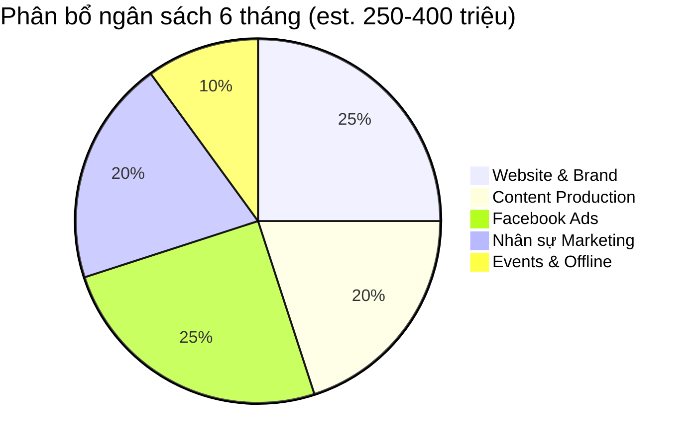
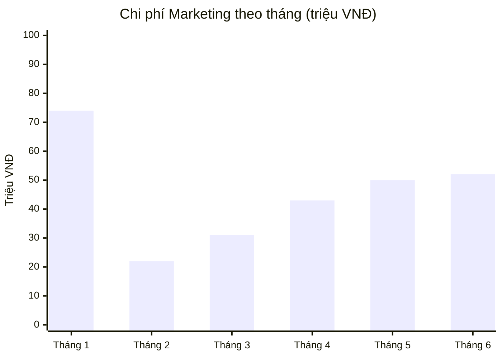
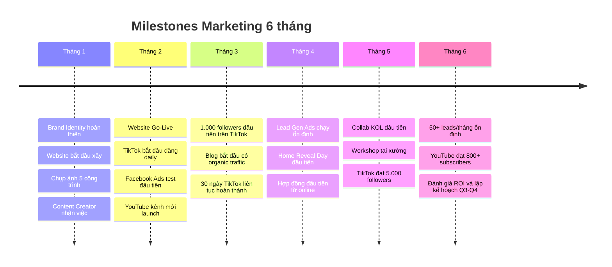

# KẾ HOẠCH HÀNH ĐỘNG MARKETING ONLINE — CHI TIẾT
## Công ty Thiết kế Thi công Nhà & Nội thất

**Ngày lập:** 05/03/2026 | **Cập nhật:** v2.0 — Chi tiết hành động & chi phí

---

## TỔNG NGÂN SÁCH 6 THÁNG

| Hạng mục | 6 tháng (triệu VNĐ) | Ghi chú |
|----------|---------------------|---------|
| Website & Brand Identity | 50-80 | Chi 1 lần |
| Content Production | 50-70 | Chụp ảnh, quay phim, edit |
| Facebook / TikTok Ads | 60-100 | Scale dần theo tháng |
| Nhân sự Marketing | 60-90 | 2-3 người |
| Events & Offline | 20-40 | Workshop, event, KOL |
| Công cụ & phần mềm | 10-20 | CRM, design tools |
| **TỔNG** | **250-400** | |

---

## THÁNG 1: CHUẨN BỊ NỀN TẢNG

### Tuần 1 (Ngày 1-7): Brand Identity

| # | Hành động | Người thực hiện | Chi phí (triệu) | Output |
|---|-----------|----------------|-----------------|--------|
| 1 | Thuê designer thiết kế Brand Identity | Agency/Freelancer | 8-15 | Logo, color palette, typography, brand guide |
| 2 | Chọn tên thương hiệu online (nếu khác tên cty) | Chủ công ty | 0 | Tên + slogan |
| 3 | Đăng ký domain website | IT/Chủ | 0.3-0.5 | Domain .com hoặc .vn |
| 4 | Tạo email doanh nghiệp (hello@, info@) | IT | 0.5-1/năm | Email chuyên nghiệp |
| 5 | Đăng tuyển Content Creator | HR/Chủ | 0 (tuyển) | JD đăng các nền tảng |

**Chi phí tuần 1:** ~10-17 triệu

### Tuần 2 (Ngày 8-14): Chụp ảnh & Quay video gốc

| # | Hành động | Người thực hiện | Chi phí (triệu) | Output |
|---|-----------|----------------|-----------------|--------|
| 6 | Thuê photographer chụp 5 công trình đẹp nhất | Photographer chuyên nghiệp | 5-10 (1-2tr/công trình) | 50-80 ảnh chất lượng cao mỗi công trình |
| 7 | Quay video xưởng sản xuất | Videographer | 3-5 | 5-10 video stock: ASMR, quy trình, hậu trường |
| 8 | Quay video walkthrough 3 công trình đẹp nhất | Videographer | 3-5 | 3 video tour 10-15 phút, cinematic |
| 9 | Thu thập testimonial video từ 3-5 khách cũ | Đội sales + videographer | 1-2 | 3-5 video 60-90s, quay tại nhà khách |
| 10 | Chuẩn bị data: bảng giá, timeline, vật liệu các dự án | KTS + Quản lý | 0 (nội bộ) | Spreadsheet data cho mỗi dự án |

**Chi phí tuần 2:** ~12-22 triệu

### Tuần 3-4 (Ngày 15-30): Xây Website + Facebook

| # | Hành động | Người thực hiện | Chi phí (triệu) | Output |
|---|-----------|----------------|-----------------|--------|
| 11 | Chọn nền tảng CMS + hosting | Dev/Agency | 2-5/năm | WordPress hoặc custom |
| 12 | Thiết kế + code website (7 trang chính) | Dev/Agency | 20-40 | Homepage, Portfolio, Services, Pricing, Blog, About, Contact |
| 13 | Upload 5 portfolio (story-based, ảnh + data) | Content team | 0 (nội bộ) | 5 case study hoàn chỉnh |
| 14 | Viết trang "Đầu tư & Chi phí" — transparent pricing | Chủ + Content | 0 (nội bộ) | Bảng giá 3 tiers |
| 15 | Setup Facebook Fanpage chuyên nghiệp | Social Media | 0 | Avatar, cover, about, menu, CTA |
| 16 | Đăng 10 bài portfolio lên Facebook | Social Media | 0 (nội bộ) | Kho content nền tảng |
| 17 | Setup Google Analytics + Search Console | Dev | 0 | Tracking sẵn sàng |
| 18 | Setup Facebook Pixel trên website | Dev | 0 | Retarget tracking |
| 19 | Tạo Facebook Group "Hội yêu nhà đẹp" | Social Media | 0 | Group + mời 50 khách cũ |
| 20 | Nhận Content Creator vào làm | HR | 8-12/tháng | Nhân sự đầu tiên |

**Chi phí tuần 3-4:** ~30-57 triệu (bao gồm 1 tháng lương)

### 📊 TỔNG CHI PHÍ THÁNG 1: 52-96 triệu

> [!IMPORTANT]
> Tháng 1 chi nhiều nhất vì là chi phí setup ban đầu (1 lần). Các tháng sau chỉ còn chi phí vận hành.

---

## THÁNG 2: KÍCH HOẠT NỘI DUNG

### Tuần 5-6: Website Go-Live + Content Engine

| # | Hành động | Chi phí (triệu) | Output |
|---|-----------|-----------------|--------|
| 21 | Website go-live + test | 0 | Website hoạt động |
| 22 | Viết 4 bài blog SEO đầu tiên | 1-2 (nếu thuê writer) | 4 bài 1500+ từ |
| 23 | Setup Zalo Business + link trên web | 0 | Kênh chat trực tiếp |
| 24 | Bắt đầu lịch đăng Facebook: 4 bài/tuần | 0 (nội bộ) | 8 bài trong 2 tuần |
| 25 | Setup TikTok Business account | 0 | Account sẵn sàng |
| 26 | Quay 15-20 video TikTok stock | 1-2 (props) | Kho video 2 tuần |

### Tuần 7-8: TikTok Launch + Facebook Ads Test

| # | Hành động | Chi phí (triệu) | Output |
|---|-----------|-----------------|--------|
| 27 | TikTok: Đăng 1 video/ngày (14 ngày liên tục) | 0 (nội bộ) | 14 video published |
| 28 | Facebook: Chạy Video View Ads — test 3 audiences | 3-4 (100-150K/ngày) | Data audience nào hiệu quả |
| 29 | Viết thêm 4 bài blog SEO | 1-2 | 8 bài tổng cộng |
| 30 | Facebook Group: Q&A live đầu tiên | 0 | Engagement + members |
| 31 | YouTube: Setup kênh + đăng 1 video Full Tour | 0 (đã quay tháng 1) | Kênh YouTube sẵn sàng |
| 32 | Tuyển/thuê Ads Manager (part-time) | 3-5/tháng | Tối ưu ads chuyên nghiệp |

### 📊 TỔNG CHI PHÍ THÁNG 2: 17-27 triệu

| Hạng mục | Chi phí (triệu) |
|----------|-----------------|
| Lương Content Creator | 8-12 |
| Blog writer (outsource) | 2-4 |
| Facebook Ads | 3-4 |
| Ads Manager (part-time) | 3-5 |
| Misc (props, tools) | 1-2 |

---

## THÁNG 3: TĂNG TỐC NỘI DUNG

| # | Hành động | Chi phí (triệu) | KPI target |
|---|-----------|-----------------|------------|
| 33 | TikTok: Tiếp tục 1 video/ngày + thêm series "Sai lầm" | 0 (nội bộ) | 500 followers |
| 34 | Facebook: Scale content 5 bài/tuần theo 5 trụ | 0 (nội bộ) | 1.000 followers |
| 35 | Facebook Ads: Tăng budget Video View + bắt đầu Retarget | 6-10 (200-300K/ngày) | 50K reach/tuần |
| 36 | YouTube: 2 video dài + 10 Shorts (repurpose TikTok) | 1-2 (edit) | 100 subscribers |
| 37 | Blog: 4-6 bài mới + optimize 8 bài cũ | 2-3 | 500 visits/tháng |
| 38 | Quay thêm batch content (1 ngày quay = 2 tuần content) | 2-3 | 30 video stock |
| 39 | Chụp ảnh 1-2 công trình mới hoàn thiện | 2-3 | Portfolio +2 |
| 40 | Facebook Group: mục tiêu 500 thành viên | 0 | 500 members |

### 📊 TỔNG CHI PHÍ THÁNG 3: 25-37 triệu

| Hạng mục | Chi phí (triệu) |
|----------|-----------------|
| Lương Content Creator | 8-12 |
| Ads Manager | 3-5 |
| Facebook Ads | 6-10 |
| Content production | 5-8 |
| Blog writer | 2-3 |

---

## THÁNG 4: CHUYÊN NGHIỆP HÓA

| # | Hành động | Chi phí (triệu) | KPI target |
|---|-----------|-----------------|------------|
| 41 | Website: Thêm chatbot AI tư vấn | 1-3 | Lead capture 24/7 |
| 42 | Website: Công cụ ước tính chi phí (v1 đơn giản) | 5-10 (dev) | 20 leads/tháng từ tool |
| 43 | TikTok: Thêm series "Đắt vs Rẻ" + "Review vật liệu" | 0 (nội bộ) | 2.000 followers |
| 44 | Facebook: Bắt đầu Lead Gen Ads | 8-12 (250-400K/ngày) | 30 leads/tháng |
| 45 | YouTube: Bắt đầu quay series "Từ A đến Z" — Tập 1,2 | 3-5 | 300 subscribers |
| 46 | Tổ chức "Home Reveal Day" cho 1 dự án bàn giao | 2-3 (decor, quay) | 1 viral video |
| 47 | Setup CRM đơn giản (Google Sheets hoặc Hubspot free) | 0 | Track mọi lead |
| 48 | Thiết lập quy trình: Lead → Contact trong 2h | 0 (nội bộ) | Response time <2h |

### 📊 TỔNG CHI PHÍ THÁNG 4: 35-52 triệu

| Hạng mục | Chi phí (triệu) |
|----------|-----------------|
| Nhân sự (Creator + Ads) | 11-17 |
| Facebook Ads (scale) | 8-12 |
| Dev tools (chatbot, ước tính) | 6-13 |
| Content production | 5-8 |
| Event (Home Reveal) | 2-3 |

---

## THÁNG 5: MỞ RỘNG

| # | Hành động | Chi phí (triệu) | KPI target |
|---|-----------|-----------------|------------|
| 49 | Facebook Ads: Lookalike audience từ khách cũ | 10-15 (300-500K/ngày) | 50 leads/tháng |
| 50 | TikTok: Collab với 1 KOL lifestyle (50K-200K followers) | 5-10 | 1 video >100K views |
| 51 | YouTube: "Từ A đến Z" Tập 3,4 + 2 video "Chi phí thực tế" | 3-5 | 500 subscribers |
| 52 | Workshop đầu tiên tại xưởng: "Tự tay làm kệ gỗ" | 3-5 (vật liệu, setup) | 10-15 người tham gia |
| 53 | Website: Virtual Tour 360° cho 2 công trình | 3-5 | WOW factor |
| 54 | Blog: Authority articles + guest post | 2-3 | 2.000 visits/tháng |
| 55 | Carousel Ads "Phong cách nào là bạn?" | Trong budget ads | Self-segment audience |

### 📊 TỔNG CHI PHÍ THÁNG 5: 40-60 triệu

| Hạng mục | Chi phí (triệu) |
|----------|-----------------|
| Nhân sự | 11-17 |
| Facebook Ads (scale) | 10-15 |
| KOL Collab | 5-10 |
| Content + Virtual Tour | 6-10 |
| Workshop | 3-5 |
| Blog | 2-3 |

---

## THÁNG 6: TỐI ƯU & HỆ THỐNG HÓA

| # | Hành động | Chi phí (triệu) | KPI target |
|---|-----------|-----------------|------------|
| 56 | Đánh giá tổng 5 tháng: kênh nào hiệu quả nhất → double down | 0 | Báo cáo ROI |
| 57 | Facebook: Scale budget cho audience & format hiệu quả nhất | 12-18 (400-600K/ngày) | 60+ leads/tháng |
| 58 | Event "Designer's Table" — Cocktail networking 10-12 khách VIP | 5-8 | 2-3 hợp đồng tiềm năng |
| 59 | YouTube: "Từ A đến Z" Tập 5,6 + Talk Show đầu tiên | 3-5 | 800 subscribers |
| 60 | TikTok: Collab KOL thứ 2 + trend hijacking liên tục | 5-8 | 8.000 followers |
| 61 | Website: Thêm trang "Digital Lookbook" + Seasonal Collection | 2-3 | Nâng tầm brand |
| 62 | Lập kế hoạch 6 tháng tiếp theo dựa trên data | 0 (nội bộ) | Plan Q3-Q4 |
| 63 | Triển khai "White Glove" after-sales cho 3 khách đã bàn giao | 1-2 | 3 referral leads |

### 📊 TỔNG CHI PHÍ THÁNG 6: 42-62 triệu

| Hạng mục | Chi phí (triệu) |
|----------|-----------------|
| Nhân sự | 11-17 |
| Facebook Ads (max) | 12-18 |
| Events (Designer's Table) | 5-8 |
| KOL + Content | 8-13 |
| Dev + misc | 3-5 |
| After-sales | 1-2 |

---

## TỔNG HỢP NGÂN SÁCH 6 THÁNG

| Tháng | Min (triệu) | Max (triệu) | Trung bình |
|-------|-------------|-------------|------------|
| **Tháng 1** (Setup) | 52 | 96 | **74** |
| **Tháng 2** | 17 | 27 | **22** |
| **Tháng 3** | 25 | 37 | **31** |
| **Tháng 4** | 35 | 52 | **43** |
| **Tháng 5** | 40 | 60 | **50** |
| **Tháng 6** | 42 | 62 | **52** |
| **TỔNG 6 THÁNG** | **211** | **334** | **272** |

> [!NOTE]
> Tháng 1 cao do chi phí setup 1 lần (brand, website, chụp ảnh). Từ tháng 2 trở đi ổn định ở mức 22-52 triệu/tháng, tăng dần theo scale ads.

---

## BẢNG SO SÁNH CHI PHÍ: TỰ LÀM vs THUÊ AGENCY

| Hạng mục | Tự làm (thuê nhân sự) | Agency marketing |
|----------|----------------------|------------------|
| Brand Identity | 8-15 triệu | 20-50 triệu |
| Website | 20-40 triệu | 50-150 triệu |
| Content/tháng | 10-15 triệu (lương) | 20-40 triệu |
| Ads Management | 3-5 triệu/tháng | 15-20% budget ads |
| **Tổng 6 tháng** | **~270 triệu** | **~500-800 triệu** |
| **Ưu điểm** | Kiểm soát, linh hoạt, xây team | Chuyên nghiệp, nhanh |
| **Nhược điểm** | Cần quản lý, chậm hơn ban đầu | Đắt, ít hiểu sản phẩm |

> [!TIP]
> **Khuyến nghị:** Tự xây team nội bộ (2-3 người) + thuê freelancer cho hạng mục chuyên môn (thiết kế brand, dev website). ROI cao hơn vì team nội bộ hiểu sản phẩm và có thể quay content hàng ngày tại xưởng + công trình.

---

## NHÂN SỰ CHI TIẾT

### Tuyển tháng 1 (Ưu tiên):

**1. Content Creator / Videographer**
| Tiêu chí | Chi tiết |
|----------|---------|
| Lương | 8-12 triệu/tháng |
| Yêu cầu | Quay/chụp bằng ĐT + máy ảnh, edit Capcut/Premiere, sáng tạo |
| Công việc | Quay video TikTok + YouTube + Facebook hàng ngày |
| Ưu tiên | Có kinh nghiệm TikTok, portfolio đẹp |
| Nơi tuyển | Facebook group "Tuyển dụng Creative", TopCV |

### Tuyển tháng 2-3 (Mở rộng):

**2. Social Media Manager**
| Tiêu chí | Chi tiết |
|----------|---------|
| Lương | 8-12 triệu/tháng |
| Yêu cầu | Quản lý 4 kênh, viết caption, lên lịch, tương tác |
| Công việc | Content calendar, community management, analytics, báo cáo |
| Có thể thay bằng | Chủ công ty kiêm trong giai đoạn đầu |

**3. Ads Manager (Part-time / Freelancer)**
| Tiêu chí | Chi tiết |
|----------|---------|
| Lương | 3-5 triệu/tháng |
| Yêu cầu | Kinh nghiệm Facebook Ads, biết đọc data |
| Công việc | Setup + tối ưu campaigns, báo cáo hàng tuần |
| Nơi tìm | Freelancer trên Upwork VN, Facebook group Ads |

---

## CONTENT CALENDAR MẪU — 1 TUẦN

| Ngày | Facebook | TikTok | YouTube | Blog |
|------|----------|--------|---------|------|
| **T2** | 📸 Album công trình + story | 🎬 60s biến hình timelapse | — | — |
| **T3** | 📊 Carousel tips thiết kế | 🎓 "Đừng mắc sai lầm này!" | Shorts (repurpose T2) | — |
| **T4** | 🏭 Video hậu trường xưởng | 🔨 ASMR xưởng gỗ | Shorts (repurpose T4) | Đăng 1 bài SEO |
| **T5** | 🔄 Before/After Reel | ❓ "A hay B?" vote | — | — |
| **T6** | 💬 Testimonial khách hàng | 💰 "Đắt vs Rẻ" | Upload 1 video dài | — |
| **T7** | 👥 Team/Behind brand | 📦 Unbox vật liệu | Shorts (repurpose T6) | — |
| **CN** | — (nghỉ hoặc repost) | 🎵 Trend hijacking | Shorts | — |

**Tổng/tuần:** Facebook 5 bài | TikTok 6-7 bài | YouTube 1 dài + 3-4 Shorts | Blog 1 bài

---

## CHECKLIST KHI BẮT ĐẦU (TUẦN ĐẦU TIÊN)

- [ ] Xác định tên thương hiệu online + slogan
- [ ] Đặt domain website
- [ ] Liên hệ designer thiết kế brand identity
- [ ] Liên hệ photographer chụp 5 công trình
- [ ] Đăng tuyển Content Creator
- [ ] Tạo tài khoản business: Facebook, TikTok, YouTube, Google
- [ ] Lập danh sách 5-8 công trình đẹp nhất + thu thập data (chi phí, diện tích, vật liệu)
- [ ] Liên hệ 3-5 khách cũ xin quay testimonial
- [ ] Chọn CMS cho website (WordPress recommended)
- [ ] Tạo Google Sheets tracking leads

---

## ROI DỰ KIẾN

| Giả định | Số liệu |
|----------|---------|
| Chi phí marketing trung bình/tháng (sau tháng 1) | ~35 triệu |
| Leads mới/tháng (tháng 4-6) | 40-60 |
| Tỷ lệ chuyển đổi lead → khách hàng | 5-10% |
| Hợp đồng mới/tháng từ online | 2-5 |
| Giá trị trung bình 1 hợp đồng | 200-500 triệu |
| **Doanh thu từ online/tháng** | **400 triệu - 2.5 tỷ** |
| **ROI** | **10x - 70x** |

> [!IMPORTANT]
> Với ngành nội thất luxury, chỉ cần **1 hợp đồng/tháng** từ kênh online là đã cover toàn bộ chi phí marketing. Mọi hợp đồng thêm đều là lợi nhuận thuần.

---

## MỐC QUAN TRỌNG (MILESTONES)

---

*Kế hoạch chi tiết được xây dựng từ phiên Brainstorming 79 ý tưởng — 05/03/2026*
