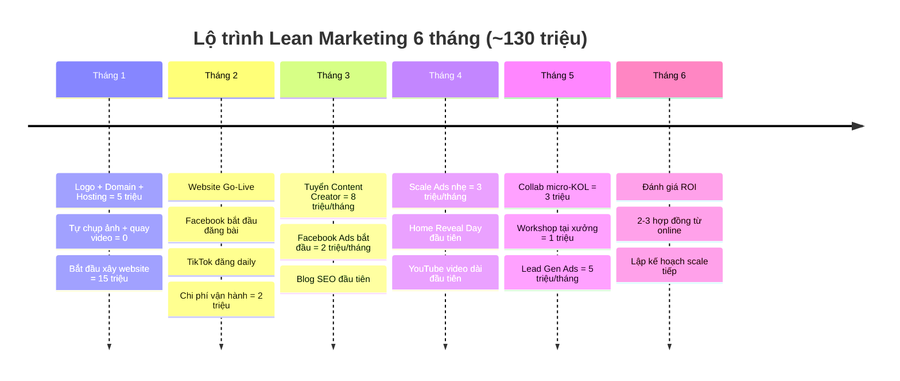

# KẾ HOẠCH MARKETING — NGÂN SÁCH TIẾT KIỆM
## Ưu tiên việc cần thiết, chi phí thấp nhất

**Ngày:** 05/03/2026 | **Tổng ngân sách 6 tháng:** ~120-150 triệu

---

## NGUYÊN TẮC: LÀM ÍT — LÀM ĐÚNG — LÀM TRƯỚC

> [!IMPORTANT]
> **Website:** Tự thực hiện — ngân sách 20 triệu (domain + hosting + theme/tools)
> **Content:** Tự quay bằng điện thoại — chi phí gần 0
> **Ads:** Bắt đầu nhỏ (50-100K/ngày), scale khi có data
> **Nhân sự:** Giai đoạn đầu chủ công ty + 1 nhân viên content

---

## TỔNG NGÂN SÁCH 6 THÁNG (LEAN)

| Hạng mục | Chi phí (triệu) | Ghi chú |
|----------|-----------------|---------|
| Website (tự làm) | 20 | Domain + hosting + theme + tools |
| Brand Identity | 3-5 | Freelancer Fiverr/VN |
| Content Production | 5-10 | Tự quay ĐT, thuê chụp ảnh 1 lần |
| Facebook Ads | 30-45 | Scale dần từ 50K → 300K/ngày |
| Nhân sự (1 người từ tháng 3) | 40-60 | Content Creator part/full-time |
| KOL + Events | 10-15 | Micro-KOL + workshop nhỏ |
| Tools & Misc | 5-10 | Canva Pro, scheduling tools |
| **TỔNG** | **~120-150** | |

---

## GĐ 1: THÁNG 1-2 — NỀN TẢNG (Chi phí: ~30-40 triệu)

**Mục tiêu:** Website live + Fanpage có nội dung + TikTok bắt đầu

### Tuần 1-2: Chuẩn bị

| # | Việc làm | Chi phí | Ai làm |
|---|---------|---------|--------|
| 1 | Thiết kế logo + brand cơ bản (Fiverr/freelancer VN) | 3-5 triệu | Freelancer |
| 2 | Mua domain + hosting | 1-2 triệu/năm | Chủ |
| 3 | Tự chụp ảnh 5 công trình bằng ĐT (quang tốt, góc đẹp) | 0 | Chủ + KTS |
| 4 | Tự quay video xưởng bằng ĐT (ASMR, hậu trường) | 0 | Chủ |
| 5 | Xin 3 khách cũ quay video testimonial 60s bằng ĐT | 0 | Chủ |
| 6 | Lập bảng data: chi phí, diện tích, vật liệu mỗi dự án | 0 | KTS |

**Chi phí tuần 1-2:** ~4-7 triệu

### Tuần 3-4: Website + Facebook

| # | Việc làm | Chi phí | Ai làm |
|---|---------|---------|--------|
| 7 | Xây website (WordPress + theme premium) | 15-18 triệu tổng | Chủ tự làm |
| 8 | Upload 5 portfolio + viết story cho mỗi công trình | 0 | Chủ |
| 9 | Viết trang "Đầu tư & Chi phí" — bảng giá 3 tiers | 0 | Chủ |
| 10 | Setup Fanpage Facebook chuyên nghiệp | 0 | Chủ |
| 11 | Đăng 10 bài portfolio lên Facebook (1 bài/ngày) | 0 | Chủ |
| 12 | Setup TikTok Business + đăng 5 video đầu tiên | 0 | Chủ |
| 13 | Đăng ký Canva Pro (thiết kế bài đăng) | 0.3 triệu/tháng | Chủ |

**Chi phí tuần 3-4:** ~15-18 triệu (chủ yếu website)

### 📊 Tổng GĐ 1: ~25-30 triệu

**Kết quả sau 2 tháng:**
- ✅ Website live với 5 công trình + bảng giá minh bạch
- ✅ Fanpage có 10+ bài chất lượng
- ✅ TikTok bắt đầu có content
- ✅ Kho ảnh/video gốc sẵn sàng

---

## GĐ 2: THÁNG 3-4 — KÍCH HOẠT (Chi phí: ~30-45 triệu/2 tháng)

**Mục tiêu:** Content đều đặn + Ads bắt đầu + Tuyển 1 người hỗ trợ

### Hàng tuần:

| Việc | Tần suất | Chi phí | Ai làm |
|------|----------|---------|--------|
| TikTok: đăng 1 video/ngày | 7/tuần | 0 | Content Creator |
| Facebook: đăng 3-4 bài/tuần | 4/tuần | 0 | Content Creator |
| YouTube Shorts: repurpose TikTok | 3-4/tuần | 0 | Content Creator |
| Blog: 2 bài SEO/tháng | 2/tháng | 0 (tự viết) hoặc 1-2tr (thuê) | Chủ/Freelancer |

### Hàng tháng:

| # | Việc làm | Chi phí/tháng | Ai làm |
|---|---------|--------------|--------|
| 14 | Tuyển Content Creator (part-time hoặc intern) | 5-8 triệu | HR |
| 15 | Facebook Ads — Video View (50-100K/ngày) | 1.5-3 triệu | Chủ học chạy ads |
| 16 | YouTube: upload 1 video dài/tháng (tour công trình) | 0 | Content Creator |
| 17 | Quay batch content: 1 buổi/tuần tại xưởng + công trình | 0 | Content Creator |
| 18 | Tạo Facebook Group + mời khách cũ | 0 | Chủ |

### 📊 Tổng GĐ 2: ~15-22 triệu/tháng × 2 = 30-45 triệu

**Kết quả sau 4 tháng:**
- ✅ TikTok: 60+ videos, bắt đầu có followers
- ✅ Facebook: content đều đặn, ads running
- ✅ YouTube: 2+ video dài + nhiều Shorts
- ✅ Blog: 4+ bài SEO bắt đầu index Google
- ✅ 1 Content Creator hỗ trợ full-time

---

## GĐ 3: THÁNG 5-6 — TĂNG TỐC (Chi phí: ~30-40 triệu/tháng)

**Mục tiêu:** Scale ads, hợp đồng đầu tiên từ online

### Hàng tháng:

| # | Việc làm | Chi phí/tháng | Impact |
|---|---------|--------------|--------|
| 19 | Scale Facebook Ads: Lead Gen (150-300K/ngày) | 5-9 triệu | 20-30 leads/tháng |
| 20 | Retarget người xem video >50% | Trong budget ads | Lead ấm |
| 21 | Content Creator lương đầy đủ | 8-12 triệu | Content ổn định |
| 22 | Collab 1 micro-KOL (5K-50K followers) | 2-5 triệu | Reach mới |
| 23 | Tổ chức 1 workshop nhỏ tại xưởng (8-10 người, 300K/vé) | 1-2 triệu net | Revenue + content + lead |
| 24 | YouTube: series "Từ A đến Z" — 2 tập đầu tiên | 0 (tự quay) | Authority |
| 25 | "Home Reveal Day" cho 1 dự án bàn giao | 0.5-1 triệu (decor) | Viral video |
| 26 | Chatbot Zalo miễn phí + auto-reply | 0 | Lead capture 24/7 |

### 📊 Tổng GĐ 3: ~15-25 triệu/tháng × 2 = 30-50 triệu

**Kết quả sau 6 tháng:**
- ✅ 30-50 leads/tháng từ online
- ✅ 2-3 hợp đồng đầu tiên từ kênh online
- ✅ TikTok: 3.000-5.000 followers
- ✅ Facebook: 2.000+ followers, group 500+ members
- ✅ YouTube: 10+ videos, 300+ subscribers

---

## WEBSITE 20 TRIỆU — PHÂN BỔ CHI TIẾT

| Hạng mục | Chi phí | Ghi chú |
|----------|---------|---------|
| Domain (.com) | 300K/năm | Namecheap hoặc Tenten.vn |
| Hosting (1 năm) | 1-2 triệu | SiteGround hoặc hosting VN |
| Theme WordPress Premium | 1.5-3 triệu | Astra Pro / flavor theme nội thất |
| Plugin portfolio/gallery | 0.5-1 triệu | bản quyền |
| Plugin SEO (RankMath Pro) | 1 triệu/năm | Optional — bản free đủ dùng |
| SSL Certificate | 0 | Free với hosting |
| Thuê freelancer setup/customize | 5-10 triệu | Nếu cần hỗ trợ kỹ thuật |
| Ảnh stock / icon bổ sung | 0.5-1 triệu | Unsplash free, mua gói icon |
| **Tổng** | **~10-18 triệu** | Còn dư cho contingency |

> [!TIP]
> **Tiết kiệm thêm:** Dùng WordPress + Starter Theme miễn phí (Astra/Kadence) + Elementor free → chi phí website chỉ còn ~3-5 triệu (domain + hosting). Dành phần còn lại cho ảnh chuyên nghiệp.

---

## CÁCH TỰ HỌC CHẠY ADS (MIỄN PHÍ)

| Nguồn | Link/Ghi chú |
|-------|-------------|
| Facebook Blueprint | Khóa học chính thức miễn phí của Meta |
| YouTube "Hướng dẫn Facebook Ads" | Nhiều channel VN dạy chi tiết |
| Group "Facebook Ads Việt Nam" | Hỏi đáp, case study thực tế |
| Bắt đầu với 50K/ngày | Test 3-5 ngày → xem data → điều chỉnh |

**Quy tắc chi ads cho người mới:**
1. Bắt đầu **Video View** (rẻ nhất, ~100-300đ/view)
2. Chạy 5-7 ngày → xem video nào nhiều view + engagement
3. Retarget người xem >50% bằng bài viết portfolio
4. Khi ổn định → chuyển sang **Lead Gen**
5. **Luôn test nhỏ trước khi scale**

---

## CONTENT TỰ QUAY BẰNG ĐIỆN THOẠI — TIPS

| Yếu tố | Cách làm | Chi phí |
|---------|----------|---------|
| **Ánh sáng** | Quay gần cửa sổ / ánh sáng tự nhiên | 0 |
| **Âm thanh** | Micro cài áo (Boya M1) | 200K |
| **Ổn định** | Tripod điện thoại | 150-300K |
| **Edit** | CapCut (miễn phí, đủ mạnh) | 0 |
| **Thumbnail** | Canva Pro | 100K/tháng |
| **Batch quay** | 1 buổi sáng = 5-7 video TikTok | 0 |

> **Mẹo vàng:** Mỗi lần ra xưởng/công trình → bật camera quay ÍT NHẤT 3 clip ngắn. Tích lũy kho content tự nhiên.

---

## CHECKLIST TUẦN ĐẦU TIÊN (CHI PHÍ: ~5 TRIỆU)

- [ ] Đặt tên thương hiệu + slogan *(0đ)*
- [ ] Mua domain *(300K)*
- [ ] Mua hosting 1 năm *(1-2 triệu)*
- [ ] Đặt logo freelancer *(2-3 triệu)*
- [ ] Tự chụp 5 công trình bằng ĐT (ánh sáng đẹp, góc rộng) *(0đ)*
- [ ] Tự quay 10 video ngắn tại xưởng *(0đ)*
- [ ] Tạo Fanpage Facebook *(0đ)*
- [ ] Tạo TikTok account *(0đ)*
- [ ] Đăng ký Canva *(miễn phí hoặc 100K/tháng)*
- [ ] Mua micro cài áo + tripod *(350-500K)*

**→ Tuần đầu tiên chỉ tốn ~5 triệu mà đã có NỀN TẢNG để bắt đầu!**

---

## TIMELINE TỔNG HỢP

---

*Kế hoạch Lean — Ưu tiên hiệu quả trên từng đồng chi phí.*
