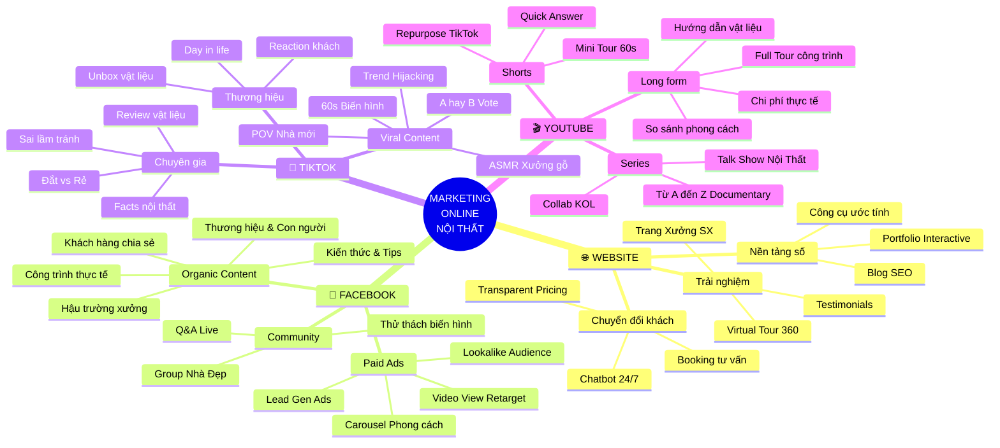
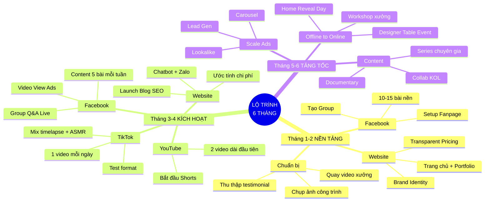
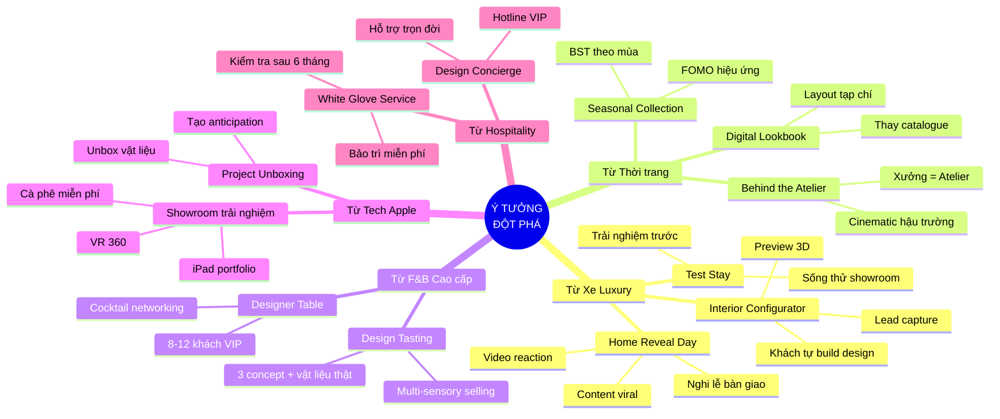
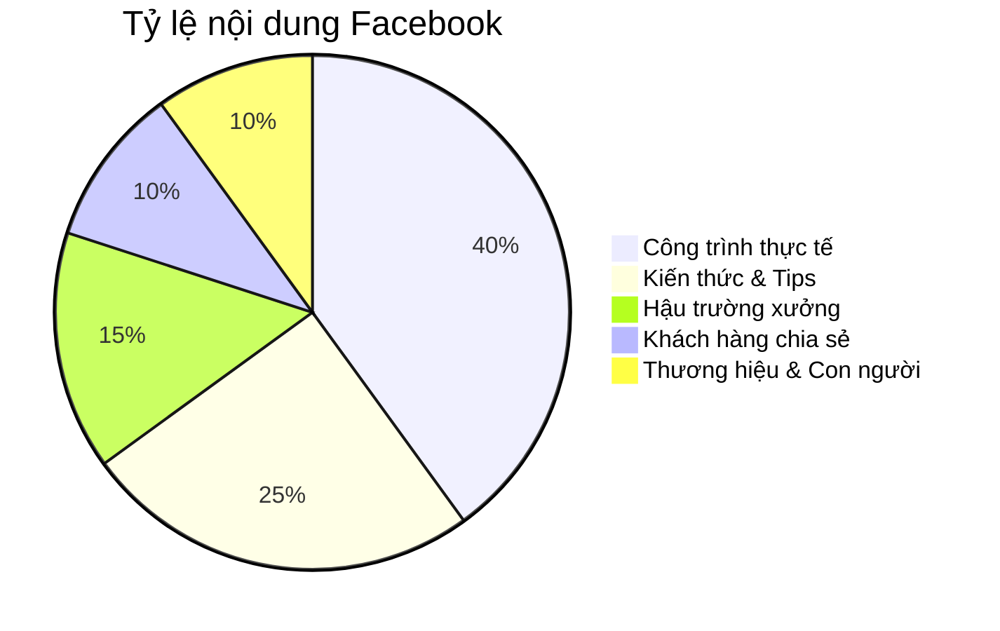
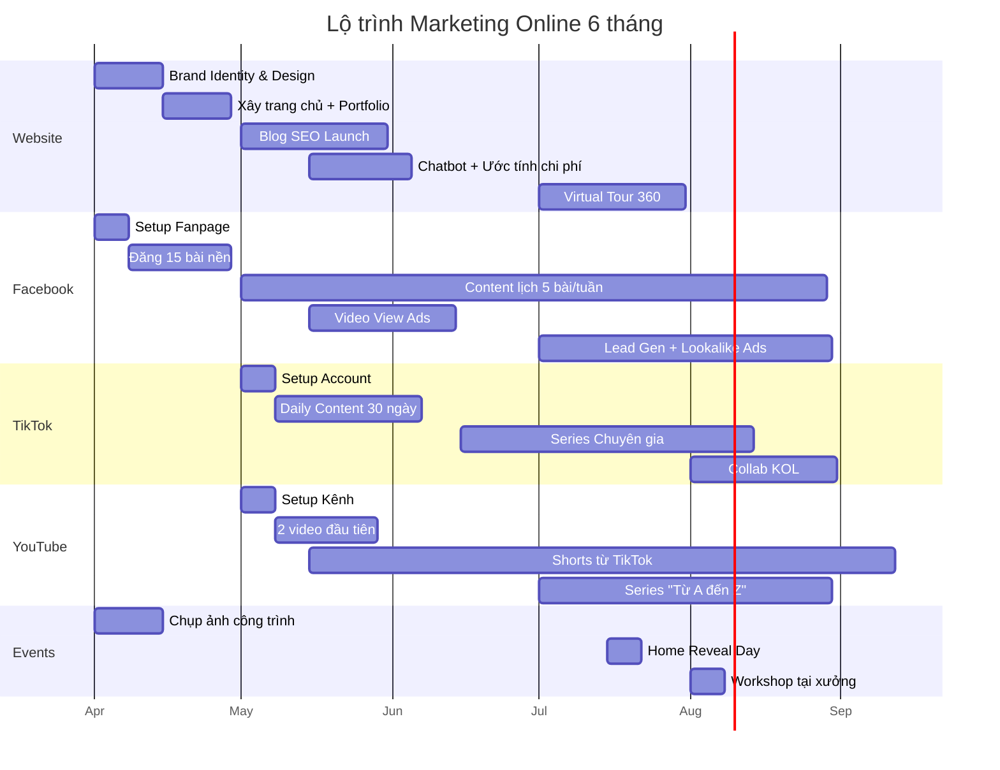
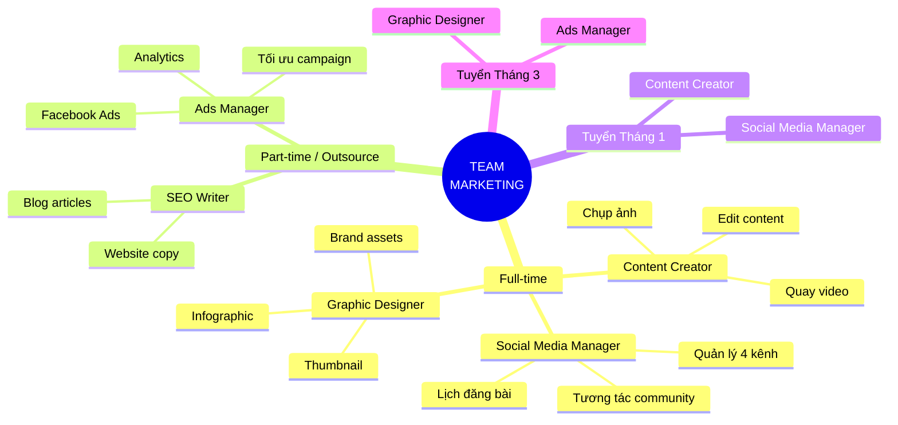

# KẾ HOẠCH MARKETING ONLINE TOÀN DIỆN
## Công ty Tư vấn Thiết kế Thi công Nhà & Nội thất

**Ngày lập:** 05/03/2026
**Phiên bản:** 1.0

---

## 1. BỐI CẢNH & MỤC TIÊU

### 1.1. Thông tin công ty
| Tiêu chí | Chi tiết |
|----------|---------|
| Quy mô | 30 nhân sự |
| Xưởng sản xuất | Có — sản xuất nội thất riêng |
| Portfolio | Biệt thự, văn phòng lớn, căn hộ cao cấp |
| Kênh hiện tại | Giới thiệu (referral) — khách hài lòng cao |
| Tệp khách mục tiêu | Người trẻ có tiền (25-40 tuổi), khách luxury |

### 1.2. Mục tiêu chiến lược
- Mở rộng kinh doanh online qua 4 kênh: Website, Facebook, TikTok, YouTube
- Tái định vị thương hiệu phân khúc **luxury**
- Xây dựng hệ thống thu hút khách hàng tự động (inbound marketing)

### 1.3. Định vị thương hiệu mới

```
CRAFTSMANSHIP × TRANSPARENCY × PROVEN TRACK RECORD
```

| Trụ cột | Ý nghĩa |
|---------|---------|
| **Craftsmanship** | Xưởng sản xuất riêng — mỗi sản phẩm là tác phẩm |
| **Transparency** | Giá minh bạch, quy trình rõ ràng |
| **Proven Track Record** | Công trình thực chứng minh năng lực |

---

## 2. MINDMAP TỔNG THỂ

### 2.1. Bản đồ chiến lược tổng quan



### 2.2. Bản đồ lộ trình triển khai



### 2.3. Bản đồ ý tưởng đột phá (Cross-Pollination)



---

## 3. CHIẾN LƯỢC TỪNG KÊNH

### 3.1. 🌐 WEBSITE — "Ngôi nhà số"

**Vai trò:** Nền tảng chuyển đổi — mọi kênh dẫn về đây

**Yêu cầu kỹ thuật:**
- CMS cho phép tự upload công trình + viết blog
- Responsive design, tốc độ tải nhanh
- SEO-optimized

**Các trang cần có:**

| Trang | Mục đích | Ưu tiên |
|-------|----------|---------|
| Trang chủ | Hero video cinematic + USP + CTA | 🔴 Cao |
| Portfolio | Story-based, before/after, filter | 🔴 Cao |
| Dịch vụ | Thiết kế, thi công, nội thất, trọn gói | 🔴 Cao |
| Đầu tư & Chi phí | Transparent pricing 3 tiers | 🔴 Cao |
| Blog | 4 chuyên mục, chuẩn SEO | 🟡 TB |
| Xưởng sản xuất | Video tour + quy trình + USP | 🟡 TB |
| Về chúng tôi | Brand story + đội ngũ + giá trị | 🔴 Cao |
| Liên hệ | Booking + Zalo chat + map | 🔴 Cao |
| Testimonials | Video + quote + rating | 🟡 TB |
| Virtual Tour | Tour 360° công trình | 🟢 Mở rộng |

**Content Strategy:**
- Blog: 4-6 bài/tháng, target SEO keywords
- Portfolio: cập nhật mỗi công trình mới hoàn thiện
- Keywords mục tiêu: "thiết kế nội thất [TP]", "chi phí thi công nhà", "nội thất cao cấp"

---

### 3.2. 📘 FACEBOOK — "Kênh tin tưởng"

**Vai trò:** Reach rộng, xây trust, chạy ads hiệu quả

**5 Trụ nội dung:**



**Lịch đăng mẫu (1 tuần):**

| Thứ | Nội dung | Format |
|-----|----------|--------|
| T2 | Công trình thực tế — Album ảnh | Album 10 ảnh + story |
| T3 | Tips thiết kế — Infographic | Carousel 5-7 slides |
| T4 | Hậu trường xưởng — Video | Video 30-60s |
| T5 | Công trình — Before/After | Reel split-screen |
| T6 | Khách hàng chia sẻ / Thương hiệu | Video testimonial / Team |

**Chiến lược Ads:**

| Giai đoạn | Loại Ads | Ngân sách/ngày | Mục tiêu |
|-----------|----------|----------------|----------|
| Tháng 2-3 | Video View | 100-200K | Build audience |
| Tháng 4 | Retarget xem video >50% | 150-250K | Warm leads |
| Tháng 5-6 | Lead Gen + Lookalike | 200-400K | Thu lead |

**Facebook Group:**
- Tên: "Hội yêu nhà đẹp — Tư vấn miễn phí"
- Hoạt động: Q&A live hàng tuần, chia sẻ kinh nghiệm
- Mục tiêu: 1.000+ thành viên trong 3 tháng

---

### 3.3. 🎵 TIKTOK — "Kênh viral"

**Vai trò:** Thu hút người trẻ có tiền, tạo brand awareness

**3 Nhóm content:**

| Nhóm | Format | Tần suất |
|------|--------|----------|
| 🔥 Viral | Timelapse, ASMR, A/B, POV, Trend | 4-5/tuần |
| 🎓 Chuyên gia | Sai lầm, Đắt vs Rẻ, Facts, Review | 2-3/tuần |
| 💎 Thương hiệu | Day in life, Unbox, Reaction | 1-2/tuần |

**Quy tắc vàng TikTok:**
1. **3 giây đầu** = hook quyết định tất cả
2. **1 video/ngày** liên tục 30 ngày đầu
3. **Quay bằng điện thoại** — authentic > chỉn chu
4. **Hashtag mix**: trend + ngành + location
5. **Double down** format nào nhiều view nhất

**Content Ideas — Top 5 dễ làm nhất:**

| # | Ý tưởng | Thời gian quay | Viral potential |
|---|---------|---------------|-----------------|
| 1 | ASMR xưởng gỗ | 30 phút | ⭐⭐⭐⭐⭐ |
| 2 | 60s biến hình timelapse | 15 phút (edit) | ⭐⭐⭐⭐⭐ |
| 3 | "A hay B?" vote | 20 phút | ⭐⭐⭐⭐ |
| 4 | Sai lầm thi công | 15 phút | ⭐⭐⭐⭐ |
| 5 | Review vật liệu | 30 phút | ⭐⭐⭐ |

---

### 3.4. 🎬 YOUTUBE — "Kênh chuyên gia"

**Vai trò:** SEO dài hạn, xây authority, content evergreen

**Cơ cấu kênh:**

| Loại | Tần suất | Thời lượng | Ví dụ |
|------|----------|-----------|-------|
| Long-form | 2-4/tháng | 10-15 phút | Full Tour, Chi phí thực tế |
| Series | 2/tháng | 8-12 phút | Từ A đến Z, Talk Show |
| Shorts | 5-7/tuần | 30-60 giây | Repurpose TikTok |

**Top YouTube SEO Keywords (VN):**
- "thiết kế nội thất căn hộ" — ~15.000 tìm/tháng
- "chi phí thi công nội thất" — ~10.000 tìm/tháng
- "tour nhà đẹp" — ~8.000 tìm/tháng
- "nội thất biệt thự" — ~5.000 tìm/tháng

**Flagship Series: "Từ A đến Z"**
```
Tập 1: Gặp khách → Tập 2: Khảo sát → Tập 3: Thiết kế
→ Tập 4: Phá dỡ → Tập 5: Thi công → Tập 6: Hoàn thiện
→ Tập 7: Bàn giao + Reaction khách
```

---

## 4. NGUYÊN TẮC THƯƠNG HIỆU LUXURY

### 4.1. Những điều KHÔNG BAO GIỜ làm

| ❌ Không làm | ✅ Thay bằng |
|-------------|-------------|
| Sale, giảm giá, khuyến mãi | "Trải nghiệm tư vấn 1:1" |
| Ảnh stock / render Internet | 100% ảnh công trình THẬT |
| "Inbox em giá" | Viết giá NGAY trong bài |
| Content spam nhiều nhưng tệ | 3-4 bài/tuần chất lượng CỰC CAO |
| Form liên hệ phức tạp | Zalo chat phản hồi 15 phút |
| Quy trình "phải gặp mới bàn" | Video call → concept 48h → gặp mặt |

### 4.2. Tone of Voice

| Yếu tố | Hướng dẫn |
|--------|-----------|
| Ngôn ngữ | Sang trọng, tự tin, tối giản |
| Xưng hô | "Chúng tôi" — không dùng "em/shop" |
| Giá trị | Nhấn mạnh craftsmanship, sự tận tâm |
| Visual | Tông màu trầm, typography premium, ảnh cinematic |

---

## 5. LỘ TRÌNH TRIỂN KHAI 6 THÁNG

### Tổng quan timeline



### Chi tiết từng giai đoạn

#### Tháng 1-2: NỀN TẢNG

| Hạng mục | Hành động cụ thể | Ngân sách |
|----------|------------------|-----------|
| Brand Identity | Logo, font, color palette, brand guide | 10-15 triệu |
| Website | Thiết kế + phát triển CMS | 15-30 triệu |
| Chụp ảnh | 5-8 công trình, ảnh chuyên nghiệp | 5-8 triệu |
| Video stock | Quay tại xưởng + công trình | 3-5 triệu |
| Facebook | Setup fanpage + 15 bài nền | 0 (nội bộ) |
| **Tổng** | | **33-58 triệu** |

#### Tháng 3-4: KÍCH HOẠT

| Hạng mục | Hành động cụ thể | Ngân sách/tháng |
|----------|------------------|-----------------|
| Blog | 8-10 bài chuẩn SEO | 3-5 triệu |
| Facebook Ads | Video View + Retarget | 4-6 triệu |
| TikTok | 1 video/ngày x 30 ngày | 2-3 triệu (edit) |
| YouTube | 2 video dài + Shorts daily | 3-5 triệu |
| Tools | Chatbot, Zalo Business, Analytics | 1-2 triệu |
| **Tổng/tháng** | | **13-21 triệu** |

#### Tháng 5-6: TĂNG TỐC

| Hạng mục | Hành động cụ thể | Ngân sách/tháng |
|----------|------------------|-----------------|
| Facebook Ads | Lead Gen + Lookalike Scale | 8-15 triệu |
| Content Pro | Series chuyên gia + Documentary | 5-8 triệu |
| KOL Collab | 1-2 influencer/tháng | 5-10 triệu |
| Events | Home Reveal + Workshop + Designer's Table | 5-10 triệu |
| **Tổng/tháng** | | **23-43 triệu** |

---

## 6. ĐỘI NGŨ MARKETING



**Lưu ý:** Giai đoạn đầu có thể 1 người kiêm nhiều vai trò. Quan trọng nhất là **Content Creator** (quay/chụp) và **Social Media Manager** (quản lý kênh).

---

## 7. KPIs & ĐO LƯỜNG

### Mục tiêu sau 6 tháng

| Kênh | KPI | Target |
|------|-----|--------|
| 🌐 Website | Monthly visits | 5.000+ |
| 🌐 Website | Leads/tháng | 50+ |
| 🌐 Website | Google ranking keywords | Top 10 cho 5+ keywords |
| 📘 Facebook | Followers | 5.000+ |
| 📘 Facebook | Leads từ ads/tháng | 20+ |
| 📘 Facebook | Group members | 2.000+ |
| 🎵 TikTok | Followers | 10.000+ |
| 🎵 TikTok | Total views | 1.000.000+ |
| 🎬 YouTube | Subscribers | 1.000+ |
| 🎬 YouTube | Videos published | 20+ |
| 💰 Revenue | Hợp đồng mới/tháng từ online | 3-5 |

### Dashboard đo lường

| Công cụ | Đo lường |
|---------|----------|
| Google Analytics | Website traffic, conversion rate |
| Facebook Business Suite | Reach, engagement, ads performance |
| TikTok Analytics | Views, followers, engagement rate |
| YouTube Studio | Watch time, subscribers, CTR |
| CRM / Google Sheets | Leads, conversion, revenue |

---

## 8. TOP 10 Ý TƯỞNG ĐỘT PHÁ

| # | Ý tưởng | Impact | Khả thi | Thực hiện |
|---|---------|--------|---------|-----------|
| 1 | 🛒 E-commerce xưởng — bán nội thất online | Rất cao | TB | Tháng 5+ |
| 2 | 💰 Transparent Pricing trên website | Rất cao | Dễ | Tháng 1 |
| 3 | 🎬 "Từ A đến Z" Documentary series | Rất cao | TB | Tháng 5+ |
| 4 | 🔧 Interior Configurator online | Rất cao | Khó | Dài hạn |
| 5 | 🏭 Workshop trải nghiệm tại xưởng | Cao | Dễ | Tháng 5+ |
| 6 | 🎉 Home Reveal Day — nghi lễ bàn giao | Cao | Dễ | Ngay khi có dự án |
| 7 | 🎵 ASMR Xưởng gỗ TikTok series | Cao | Rất dễ | Tháng 3 |
| 8 | 💵 "Chi phí thực tế" YouTube series | Rất cao | Dễ | Tháng 3 |
| 9 | 👔 White Glove after-sales service | Cao | TB | Tháng 4+ |
| 10 | 🏠 Design Club Membership | Cao | TB | Tháng 5+ |

---

## 9. RỦI RO & GIẢI PHÁP

| Rủi ro | Giải pháp |
|--------|-----------|
| Thiếu content quay phim | Batch quay: 1 ngày quay = 2 tuần content |
| Budget hạn chế giai đoạn đầu | Ưu tiên organic content trước, ads sau |
| Không có người chuyên marketing | Tuyển 1 Content Creator đa năng đầu tiên |
| Khó duy trì lịch đăng | Lập content calendar 1 tháng trước |
| Ads chưa hiệu quả | Test nhỏ → đo → tối ưu → scale |

---

## 10. TÓM TẮT

> **Chiến lược cốt lõi:** Biến tài sản sẵn có (xưởng sản xuất + công trình thực tế + khách hàng hài lòng) thành hệ sinh thái nội dung digital — phân phối qua 4 kênh với định vị luxury và minh bạch.

**3 việc làm NGAY trong tuần đầu tiên:**
1. ✅ Thiết kế Brand Identity (logo, màu sắc, font chữ)
2. ✅ Đặt lịch chụp ảnh chuyên nghiệp 5 công trình đẹp nhất
3. ✅ Đăng tuyển Content Creator

---

*Báo cáo được tạo từ phiên Brainstorming với 79 ý tưởng qua 3 kỹ thuật: Mind Mapping, SCAMPER, Cross-Pollination.*
